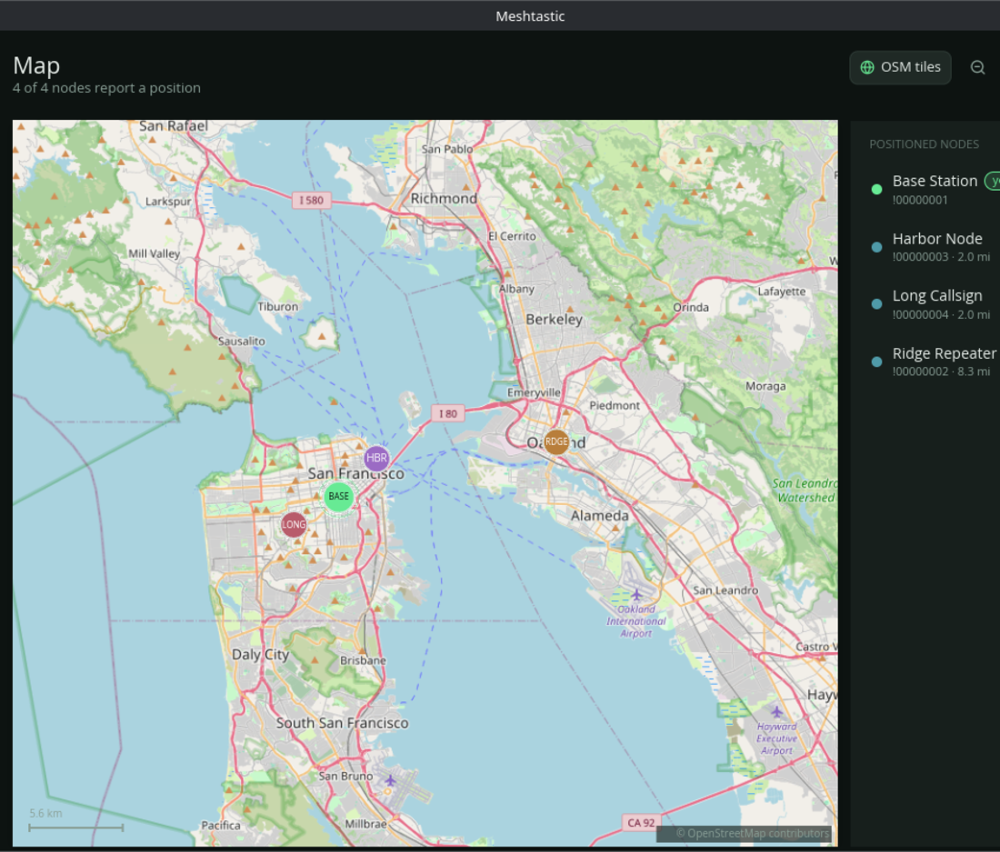

# Meshtastic Desktop

An open-source [Meshtastic](https://meshtastic.org) client for Linux, built with
Rust and [iced](https://iced.rs). Connect to your mesh over Bluetooth LE, USB
serial, or TCP/WiFi and manage nodes, channels and messages from a native
desktop app.



## Features

**Connectivity**

- Bluetooth LE, USB serial and TCP/WiFi transports behind one connection view.
- Automatic discovery: BLE scan, USB serial adapters, and mDNS for networked
  nodes, plus manual entry for anything else (IP, hostname, `/dev/...`, or a BLE
  MAC address).
- In-app BLE pairing with a PIN dialog, backed by a BlueZ pairing agent.
- Reconnect automatically to the last used device.

**Messaging**

- Direct messages and channel broadcasts with delivery status.
- Markdown rendering with clickable links and live relative timestamps.
- A per-conversation security indicator: encrypted, verified, no key, or key
  mismatch for direct messages, and the channel's AES strength for broadcasts.

**Nodes**

- A full node database synced after the handshake, with favourites and mute.
- Node detail: identity, role, hardware, signal, position and distance,
  key/security state, device metrics, environment telemetry and traceroutes.
- Request a position, run a traceroute, and share or import contacts.

**Map**

- Pan and zoom a canvas with avatar markers and a positioned-node list.
- An optional online OpenStreetMap tile layer (toggle in the Map header or in
  Settings), with neighbour-zoom fallback so zooming never blanks the map.

**Configuration**

- Editors for the device and module configuration sections and the eight channel
  slots.
- App settings: theme (dark/light/system), units, notifications, send-on-Enter,
  scan-on-start, and the online tile layer.

**Host integration**

- The device clock is set from this computer on every connect.
- "Fill from host" reads the computer's timezone (converting the IANA zone to
  the POSIX `tzdef` the firmware expects) and sends it to the device.
- "Use host location" tries GeoClue2, then gpsd, then (opt-in) a city-level IP
  lookup, and sets the result as the device's fixed position. Coordinates can
  also be entered by hand.

**Desktop integration**

- A system tray icon (StatusNotifierItem) with a live status tooltip, a
  show/hide action and quit.
- Close-to-tray so the client keeps running in the background.
- Desktop notifications for incoming messages, attributed to the app icon.

## Building

Prerequisites:

- Rust 1.85 or newer (edition 2024).
- A Linux desktop with Vulkan or OpenGL drivers.
- System development libraries: `pkg-config`, D-Bus headers (for the BlueZ
  backend) and udev headers (for USB serial).

Install the system packages for your distribution:

```sh
# Debian / Ubuntu
sudo apt install build-essential pkg-config libdbus-1-dev libudev-dev \
  libvulkan1 mesa-vulkan-drivers

# Fedora
sudo dnf install gcc pkgconf-pkg-config dbus-devel systemd-devel \
  vulkan-loader mesa-vulkan-drivers

# Arch
sudo pacman -S --needed base-devel dbus systemd mesa vulkan-icd-loader
```

Then clone and run:

```sh
git clone https://github.com/drakeerv/meshtastic-desktop.git
cd meshtastic-desktop
cargo run --release
```

## Running and permissions

- **USB serial**: your user needs access to the serial device. Add yourself to
  the `dialout` group (Debian/Fedora) or the `uucp` group (Arch), then log back
  in:

  ```sh
  sudo usermod -aG dialout "$USER"
  ```

- **Bluetooth LE**: BlueZ must be running. Meshtastic devices require bonding,
  so the first connection asks for the PIN shown on the node's screen. A few BLE
  adapters mishandle LE Secure Connections; an RTL8761BU (for example the
  TP-Link UB500) or an Intel AX210/BE200 works reliably.

- **Desktop integration**: install the binary, then the app icon and
  `.desktop` entry so the window is associated with its icon. The entry points
  at the `cargo install`ed binary, so install it first (requires ImageMagick's
  `magick`):

  ```sh
  cargo install --path .
  scripts/install-desktop.sh
  ```

- **Host location**: enable **Share host location** in Settings to stream
  this computer's position to the connected device (updates on movement or
  every 30 s). It tries **GeoClue2** (the `geoclue` package) and **gpsd** (with
  a USB/serial GPS). To skip the GeoClue agent's authorization prompt, run
  `scripts/install-geoclue.sh`, which installs an allow-list drop-in for
  `org.meshtastic.Meshtastic` under `/etc/geoclue/conf.d/`. Without it, agents
  such as `geoclue-demo-agent` need the desktop entry from
  `scripts/install-desktop.sh` (which carries `X-Geoclue-Reason`). The opt-in
  **IP fallback** needs no setup but is city-level and shares your public IP
  with a third-party service. Manual latitude/longitude entry always works.

## Workspace layout

| Crate | Responsibility |
| --- | --- |
| `mt-protocol` | Protobuf frame codec, `ToRadio` builders, shared-contact links |
| `mt-transport` | TCP, USB serial and BLE transports, discovery, BlueZ pairing |
| `mt-core` | Connection supervisor, handshake, packet ingest, outbound dispatch |
| `mt-persistence` | Per-device SQLite storage (nodes, messages, channels, telemetry) |
| `src/` | The iced application: views, state and update logic |

The UI depends only on `mt-core`'s command and event interface, so the backend
can be tested without a display.

## Development

```sh
cargo fmt
cargo test --workspace
```

## License

[MIT](LICENSE). Vendored Meshtastic artwork is covered by
[`assets/meshtastic/ATTRIBUTION.md`](assets/meshtastic/ATTRIBUTION.md).

## Disclaimer

This project is not affiliated with or endorsed by Meshtastic LLC. "Meshtastic"
and the Meshtastic logo are trademarks of Meshtastic LLC. The optional online
map tiles are served by OpenStreetMap and are subject to their usage policy.
